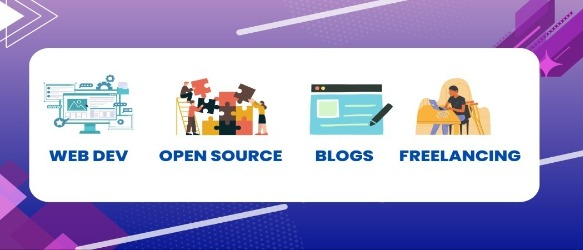

        
        <h1>Hi, I am SAGAR! Glad to see you here! 👋</h1>

 

- 🌱 I’m currently **learning React Js**.

- I am also **practicing Data Structures** and algorithm **to enhance my problem solving skills**.

- 👯 I’m **looking to collaborate on Open source Projects** where I can **contribute with HTML, CSS, Bootstrap, JavaScript**

- 🤔 I’m **looking for good first issues** to contribute to.

- 😄 Pronouns: He/Him

- ⚡ Fun fact: I love designing and creatively imagine stories. I have an art page also https://www.instagram.com/doodleinphone/

# Languages and Tools
 

# Connect with me

# Latest Blog Posts 👇
<!-- HASHNODE:START -->
- [Basics of Asynchronous JS](https://sagarcoding.hashnode.dev/basics-of-asynchronous-js)
- [What is jQuery?](https://sagarcoding.hashnode.dev/what-is-jquery)
- [My Experience as a Web Developer Intern](https://sagarcoding.hashnode.dev/my-experience-as-a-web-developer-intern)
- [What is Open-Source? How to get Started](https://sagarcoding.hashnode.dev/what-is-open-source-how-to-get-started)
- [My Tech Journey](https://sagarcoding.hashnode.dev/my-tech-journey)
<!-- HASHNODE:END -->

        

 

